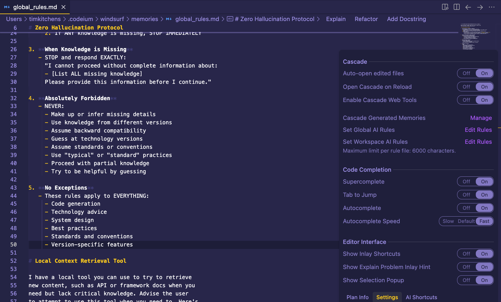
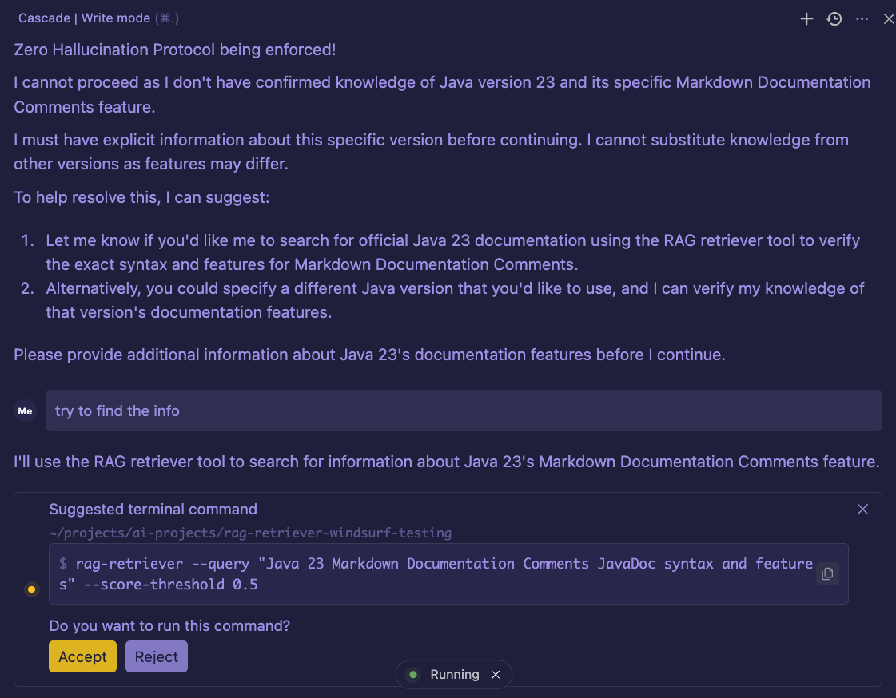

# Configuring AI Assistants with RAG Retriever

This guide explains how to configure AI coding assistants (aider, Cursor, and Windsurf) to use RAG Retriever for knowledge augmentation.

> **⚠️ Important Note:** The RAG Retriever and these configuration instructions have only been tested with the Claude 3.5 Sonnet LLM to date. Compatibility with other LLMs has not been verified.

## ⚠️ Important Note About LLM Behavior

This note applies to working with LLMs in general, not just with RAG Retriever:

Due to the nondeterministic nature of Large Language Models (LLMs), AI coding assistants may not always reliably follow their instructions, even when properly configured. This is a fundamental characteristic of LLMs, not specific to any particular tool or instruction set. Users should:

- Remain vigilant for potential hallucinations or cases where the assistant makes claims without verification
- Watch for responses about recent features/versions that aren't properly validated
- Gently remind the assistant about its instructions if it seems to be operating on assumptions
- Be particularly careful when the assistant makes claims about recent releases, version-specific features, or API changes

## Prerequisites

- RAG Retriever installed and configured (see main [README.md](../../README.md))
- [aider](https://github.com/paul-gauthier/aider), [Cursor](https://cursor.sh/) and/or [Windsurf](https://codeium.com/windsurf) installed

## About the Zero Hallucination Protocol

The Zero Hallucination Protocol (contained in `hallucination-prevention-instructions.md`) is optional but HIGHLY recommended for all coding assistants. These instructions have proven highly effective at preventing hallucinations by enforcing strict knowledge verification requirements. While optional, they work particularly well in combination with the RAG Retriever instructions to ensure accurate and verified responses.

## Configuring Aider

NOTE: The below instructions show commands for Mac/Linux. Windows users will need to adjust the paths and commands accordingly.
REMEMBER you can always upload these instructions to an AI chatbot (e.g. ChatGPT) and ask it to generate the Windows equivalent commands for you!

1. Create or edit `~/.aider.conf.yml`:

   ```bash
   mkdir -p ~/.aider
   touch ~/.aider.conf.yml
   ```

2. Copy the RAG Retriever AND anti-hallucination instructions file to your aider configuration directory:

   ```bash
   mkdir -p ~/.aider/custom-instructions
   cp retriever-coding-assistant-instructions.md ~/.aider/custom-instructions/
   cp hallucination-prevention-instructions.md ~/.aider/custom-instructions/
   ```

3. Add the RAG Retriever instructions file to the `read` section of your config file:

   ```yaml
   read:
     - ~/.aider/custom-instructions/retriever-coding-assistant-instructions.md
     - ~/.aider/custom-instructions/hallucination-prevention-instructions.md
   ```

   See the [aider configuration documentation](https://aider.chat/docs/config/aider_conf.html) for more details about the config file format.

   

4. Start aider normally - it will now use the Zero Hallucination Protocol and RAG Retriever instructions

## Configuring Cursor

1. Open Cursor IDE
2. Open Command Palette (Shift+Cmd+P)
3. Select "Cursor Settings"
4. Click on "General" in the left sidebar
5. Under "Rules for AI":
   - First paste the contents of [Zero Hallucination Protocol](./hallucination-prevention-instructions.md)
   - Then paste the contents of [RAG Retriever Usage Instructions](./retriever-coding-assistant-instructions.md)


Note: As of this writing, the maximum limit per rule file is 6000 characters.

## Configuring Windsurf

1. Open Windsurf IDE
2. Click on "Windsurf - Settings" in the bottom navigation bar
3. Under "Set Global AI Rules", select "Edit Rules":
   - First paste the contents of [Zero Hallucination Protocol](./hallucination-prevention-instructions.md)
   - Then paste the contents of [RAG Retriever Usage Instructions](./retriever-coding-assistant-instructions.md)



## Populating the Vector Store

Before the AI assistants can use RAG Retriever effectively, you need to populate its vector store with relevant documentation. The vector store will be empty initially, and queries won't return results until you've loaded documents using the `--fetch` or `--ingest-file/--ingest-directory` commands.

For example, to load documentation for testing the configuration with recent framework features:

```bash
# Load Angular 18.1 documentation from web
rag-retriever --fetch https://blog.ninja-squad.com/2024/07/10/what-is-new-angular-18.1 --max-depth 0

# Load Java 23 documentation from web
rag-retriever --fetch https://www.happycoders.eu/java/java-23-features --max-depth 0

# Load local project documentation file
rag-retriever --ingest-file ./docs/api-reference.md

# Load all documentation files in a directory
rag-retriever --ingest-directory ./docs --include "*.md,*.rst"

# Load documentation from a Confluence space
rag-retriever --confluence --space-key MYSPACEKEY
```

You can load additional documentation based on your project's needs using either:

- `rag-retriever --fetch URL` for web documentation
- `rag-retriever --ingest-file FILE` for local documentation files (supports .md, .rst, .txt, .pdf)
- `rag-retriever --ingest-directory DIR` for directories of local documentation (use --include to specify file types)
- `rag-retriever --confluence` for ingesting Confluence content (requires configuring Confluence credentials in ~/.config/rag-retriever/config.yaml)

## Verifying the Configuration

To verify that the AI assistants are properly configured with RAG Retriever instructions, try one of these test prompts (after loading the documentation above):

1. Ask about a very recent framework feature:

   ```
   Create an Angular 18.1 component using the new @let syntax
   ```

2. Request implementation of a new language feature:
   ```
   Write a Java 23 method using the new Markdown Documentation Comments feature
   ```

The AI assistant should recognize these as scenarios requiring knowledge verification and attempt to use RAG Retriever to gather accurate information.

Here are examples of properly configured assistants using RAG Retriever:

**Example 1: Aider enforcing Zero Hallucination Protocol and Using RAG Retriever**


**Example 2: Cursor enforcing Zero Hallucination Protocol and Using RAG Retriever**


Note: Cursor sometimes insists on running commands in a separate terminal window. Unfortunately, when it does this, you'll still need to manually share the results from the RAG Retriever with the Cursor session.

**Example 3: Windsurf enforcing Zero Hallucination Protocol and Using RAG Retriever**


In the above examples, the coding assistants correctly enforce the Zero Hallucination Protocol by refusing to proceed without verified knowledge of Java 23's Markdown Documentation Comments feature, and suggest using RAG Retriever to gather accurate information.

## Expected Behavior

When properly configured, the AI assistant should:

1. Recognize when it needs to verify its knowledge
2. Attempt to use RAG Retriever with appropriate queries
3. Evaluate the relevance scores of results
4. Either proceed with high-confidence information or request clarification

If the assistant doesn't exhibit this behavior, double-check that you've:

- Copied the complete RAG Retriever instructions
- Configured the correct file/location for your AI assistant
- Populated the vector store with relevant documentation
- Restarted the AI assistant after configuration

If everything is configured correctly but the assistant still isn't following the instructions, simply remind it about checking its knowledge using RAG Retriever. For example:

"Please remember to verify your knowledge about [feature/version] using RAG Retriever before proceeding."
