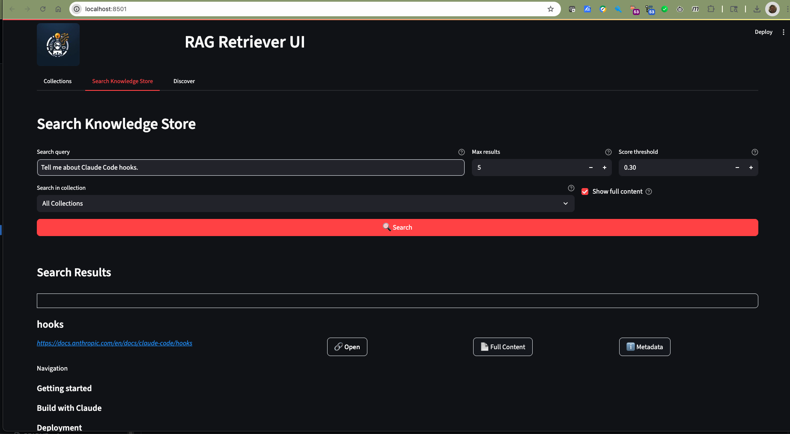

# RAG Retriever UI User Guide

The RAG Retriever UI provides a modern, intuitive interface for managing and searching your document collections. This guide will walk you through the main features and how to use them effectively.

## Launching the UI

To start the RAG Retriever UI, run the following command from your terminal:

```bash
streamlit run rag_retriever/ui/app.py
```

This will launch the Streamlit-based interface in your default web browser.

## Main Features

### Collections Management


The Collections view provides a comprehensive overview of all your document collections:

- View all collections in a sortable table
- See key metrics like document count and total chunks
- Track creation and modification timestamps
- Manage collection descriptions

#### Collection Actions

For any selected collection (except the default collection), you can:

- Edit the collection description
- Delete the collection
- View detailed statistics
- Compare with other collections

#### Deleting Collections


When deleting a collection:

1. Select the collection you want to delete
2. Click the "Delete Collection" button
3. Confirm the deletion in the warning dialog
4. The collection and all its contents will be permanently removed

> ⚠️ **Warning**: Collection deletion cannot be undone. Make sure you want to permanently remove the collection and all its contents.

### Search Interface



The Search tab offers powerful semantic search capabilities:

- Search across all collections or within a specific one
- Adjust search parameters:
  - Maximum number of results
  - Score threshold for relevance (0-1)
  - Option to show full content
- View search results with:
  - Color-coded relevance scores
  - Source information
  - Expandable content previews
  - Detailed metadata

### Collection Statistics


The Statistics view provides detailed insights into your collections:

- Document and chunk counts
- Average chunks per document
- Collection timeline showing:
  - Creation date
  - Last modification date
  - Collection age
- Interactive charts visualizing:
  - Document distribution
  - Chunk distribution
  - Collection growth over time

### Collection Comparison


The comparison feature allows you to analyze multiple collections side by side:

- Compare document and chunk counts across collections
- View average chunks per document for each collection
- Analyze collection timelines and ages
- Interactive charts showing:
  - Side-by-side metrics comparison
  - Relative collection sizes
  - Collection age distribution

## Using the Interface

### Managing Collections

1. Navigate to the Collections tab
2. View all collections in the table
3. Select a collection to manage
4. Use the action buttons to:
   - Edit collection description
   - Delete collection
   - View statistics
   - Compare with other collections

### Performing Searches

1. Switch to the Search tab
2. Enter your search query
3. Adjust search parameters as needed:
   - Set maximum results (default: 5)
   - Adjust score threshold (default: 0.3)
   - Choose whether to show full content
4. Select a specific collection or search across all collections
5. Click the Search button to execute
6. Review results with their relevance scores and content

### Analyzing Statistics

1. From the Collections view, select a collection
2. Click "View Collection Stats" for individual analysis
3. Use "Compare Collections" to view side-by-side comparisons
4. Explore the interactive charts and metrics
5. Use the timeline view to track collection growth and updates

## Tips and Best Practices

- **Search Optimization**: Start with a lower score threshold (0.3) and adjust up if you need more precise results
- **Collection Management**: Keep descriptions up-to-date for better organization
- **Performance**: When comparing collections, start with 2-3 collections for best visualization
- **Content Preview**: Use the "Show full content" option judiciously with large documents

## Keyboard Shortcuts

- `Ctrl/⌘ + K`: Focus search input
- `Ctrl/⌘ + /`: Show help
- `Esc`: Clear selection

## Getting Help

If you encounter any issues or need additional help:

- Check the [main documentation](https://github.com/codingthefuturewithai/rag-retriever)
- Submit issues on GitHub
- Reach out to the community for support
